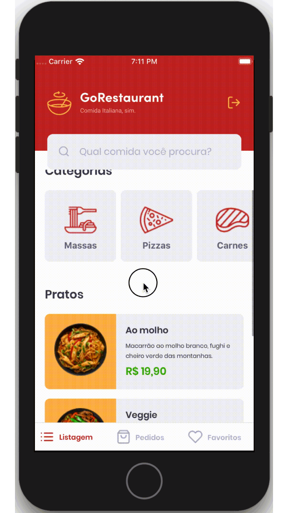

<div align="center">
  
</div>

<h3 align="center">
  Challenge 11 of the GoStack: GoRestaurants Mobile
</h3>

<p align="center">“Nothing in the world beats persistence.”!</blockquote>

<p align="center">
  

  

  
</p>

<br>

### 📝 About the project
In this challenge, you will be able to develop yet another application, a GoRestaurant. Now you can practice or learn so far in React Native together with TypeScript, to create a small app for ordering food.

This will be an application that will allow you to connect a fake API, and display the created food dishes and allow create, delete and updating of these dishes.

<div align="center">
  
</div>

<br>

## 🤖 Mobile
Was used React Native and TypeScript, to the connect with the FakeApi and display and filter API food dishes and allow new orders to be created.

### 🛠 Technologies
- **[React Native](https://reactnative.dev/)**
- *[TypeScript](https://www.typescriptlang.org/)*
- *[Axios](https://github.com/axios/axios)*

<br>

## 🏁 Starting the project
Clone the project: `git clone https://github.com/leopacciulli/Bootcamp-GoRestaurant-Mobile.git`

<br>

🤖 To run the **Mobile**
<br>Open the terminal and run the following commands:

````zsh
# to enter the Front-end folder
$ cd Bootcamp-GoRestaurant-Mobile

# to run the FAKE API
$ yarn json-server server.json -p 3333

# to download the dependencies
$ yarn

# ONLY iOS - before run
$ cd ios and run: pod install

# to start the application on the emulator
$ yarn ios (or) yarn android
````

<br>

⚙️ Optional step to **run the Tests:**

````zsh
# to enter the Back-End folder
$ cd Bootcamp-GoRestaurant-Mobile

# to run tests
$ yarn test
````

---

<h3 align="center">
  Made with love by 💙 Leonardo Pacciulli
</h3>

<p align="center">
  <a href="https://www.linkedin.com/in/leonardo-pacciulli">
    
  </a>
  <a href="https://www.facebook.com/paculli">
    
  </a>
  <a href="https://www.instagram.com/leopacciulli/">
    
  </a>
</p>
